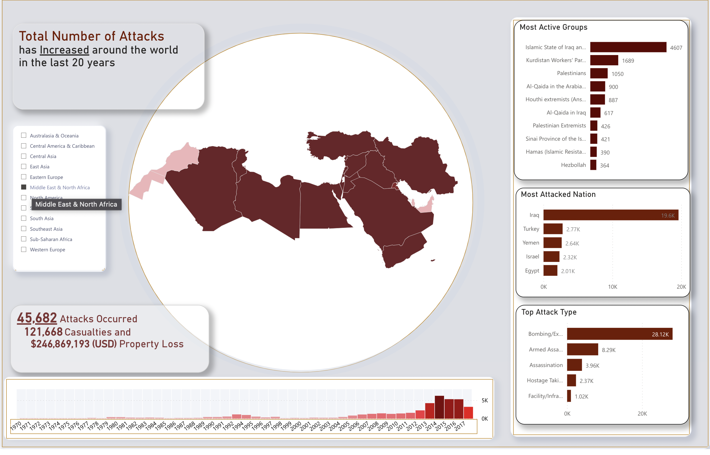

#  Exploratory Data Analysis - Global Terrorism
As a security/defense analyst, we will try to find hot zone of terrorism across the world.
We will create a Power BI Dashboard using the dataset [Global Terrorism](https://drive.google.com/file/d/1luTU7xBvI7QAGPbQMxEHcgKUi9d6UeP_/view).

___
## This project will be split into 2 parts:
- data _preprocessing_ using [Python Notebook](./GT%20data%20pre-processing%20and%20modeling.ipynb): where we will split our one large 181691 records and 128 wide columns into star schema for better analysis and performance.
  
- [Power BI Dashboard](./Global%20Terrorism%20Dashboard.pbix):  
  
  -  where we tried to provide **general insights** such as:
       -  total events.
       -   top attacks type and most used weapons.
        -   most active groups.
        -   top targeted nations and units, and reasons behind these attacks.
        -   Property Loss in USD per regions and countries. 
        -   Time Trend Analysis on attacks per region and countries between years  [**1970** - **2017**].
  
  | __2014__ was the most active year across all Time Period.

  - secondly we presented **Countries Insights**:
     - Most Active Group per Country.
     - total suicide attacks, kidnapping events, and Property loss.
     - provided a heatmap for attacks per states and cities

| __Iraq__ is one of the most dangerous countries across world with a total  ~__23,000__ attack  with around __3,926__ attack taking place on the year `2014`.
  - also we  produced **groups insights** such as 
    - Active Years
    - Total Attacks
    - Success Rate
    - Is the group use suicidal attacks as a mean for accomplishing goals by checking suicide attacks rate to total attacks.
    - Top attacks type and favorite weapons per group.
    - Most Targeted Institutions. 


| `ETA` is one of the oldest Groups working between the years __1972__ and __2010__, working across all of `Europe`, with a total attacks of 1650 and a success Rate of 85.45%, they mostly attacked the `Civil Guard and Police` Targets while mostly using Explosives and Firearms as their main weapons.

___

## Part 1:  Data Preprocessing:  
After Exploring the data and modeling the Data here is the star schema used for developing the dataset


<details>
  <summary> Jupyter Notebook</summary>


```python
import pandas as pd
import numpy as np

df = pd.read_csv('./Dataset/globalterrorismdb_0718dist.csv', encoding = "ISO-8859-1")

print(*df.columns, sep=' , ')
```

    /var/folders/00/0s56_3496fb7660g8b7bwcyh0000gn/T/ipykernel_70881/2654467892.py:4: DtypeWarning: Columns (4,6,31,33,61,62,63,76,79,90,92,94,96,114,115,121) have mixed types. Specify dtype option on import or set low_memory=False.
      df = pd.read_csv('./Dataset/globalterrorismdb_0718dist.csv', encoding = "ISO-8859-1")


    eventid , iyear , imonth , iday , approxdate , extended , resolution , country , country_txt , region , region_txt , provstate , city , latitude , longitude , specificity , vicinity , location , summary , crit1 , crit2 , crit3 , doubtterr , alternative , alternative_txt , multiple , success , suicide , attacktype1 , attacktype1_txt , attacktype2 , attacktype2_txt , attacktype3 , attacktype3_txt , targtype1 , targtype1_txt , targsubtype1 , targsubtype1_txt , corp1 , target1 , natlty1 , natlty1_txt , targtype2 , targtype2_txt , targsubtype2 , targsubtype2_txt , corp2 , target2 , natlty2 , natlty2_txt , targtype3 , targtype3_txt , targsubtype3 , targsubtype3_txt , corp3 , target3 , natlty3 , natlty3_txt , gname , gsubname , gname2 , gsubname2 , gname3 , gsubname3 , motive , guncertain1 , guncertain2 , guncertain3 , individual , nperps , nperpcap , claimed , claimmode , claimmode_txt , claim2 , claimmode2 , claimmode2_txt , claim3 , claimmode3 , claimmode3_txt , compclaim , weaptype1 , weaptype1_txt , weapsubtype1 , weapsubtype1_txt , weaptype2 , weaptype2_txt , weapsubtype2 , weapsubtype2_txt , weaptype3 , weaptype3_txt , weapsubtype3 , weapsubtype3_txt , weaptype4 , weaptype4_txt , weapsubtype4 , weapsubtype4_txt , weapdetail , nkill , nkillus , nkillter , nwound , nwoundus , nwoundte , property , propextent , propextent_txt , propvalue , propcomment , ishostkid , nhostkid , nhostkidus , nhours , ndays , divert , kidhijcountry , ransom , ransomamt , ransomamtus , ransompaid , ransompaidus , ransomnote , hostkidoutcome , hostkidoutcome_txt , nreleased , addnotes , scite1 , scite2 , scite3 , dbsource , INT_LOG , INT_IDEO , INT_MISC , INT_ANY , related


```python
df.shape
```


    (181691, 135)


---
## 1-DimLocation


```python
dim_location = df.loc[:,
    ['country_txt',
     'region_txt',
     'provstate',
     'city']
]

replace_regex = '\(((\s*\w*\s*)*)\)|-*|\,|\'|\/|\.*|\(*\)*|\?|\=|\*'

dim_location['city'] = dim_location['city'].\
    replace(to_replace=replace_regex, value="", regex=True).\
    fillna('Unkonwn').\
    str.replace('&', 'and').\
    str.replace('Unkknown', 'Unknown').\
    str.title().\
    str.strip()

dim_location['provstate'] = df['provstate'].\
    replace(to_replace=replace_regex, value="", regex=True).\
    fillna('Unknown').\
    str.replace('é', 'e').\
    str.replace('&', 'and').\
    str.replace('temouchent', 'tecmouchent').\
    str.replace('Bosnia-Herzegovina', 'Bosnia And Herzegovina').\
    str.replace('ñ', 'n').\
    str.title().\
    str.strip()

dim_location.drop_duplicates(inplace=True)
dim_location['Location Id'] = dim_location.reset_index(drop=True).index + 1


dim_location.rename(columns={
                'country_txt': 'Country',
                'region_txt': 'Region',
                'provstate': 'Provenance/State',
                'city': 'City',}, inplace=True)
print(dim_location.shape)
dim_location.head()
```

    (40676, 5)


<div>
<style scoped>
    .dataframe tbody tr th:only-of-type {
        vertical-align: middle;
    }

    .dataframe tbody tr th {
        vertical-align: top;
    }

    .dataframe thead th {
        text-align: right;
    }
</style>
<table border="1" class="dataframe">
  <thead>
    <tr style="text-align: right;">
      <th></th>
      <th>Country</th>
      <th>Region</th>
      <th>Provenance/State</th>
      <th>City</th>
      <th>Location Id</th>
    </tr>
  </thead>
  <tbody>
    <tr>
      <th>0</th>
      <td>Dominican Republic</td>
      <td>Central America &amp; Caribbean</td>
      <td>Unknown</td>
      <td>Santo Domingo</td>
      <td>1</td>
    </tr>
    <tr>
      <th>1</th>
      <td>Mexico</td>
      <td>North America</td>
      <td>Federal</td>
      <td>Mexico City</td>
      <td>2</td>
    </tr>
    <tr>
      <th>2</th>
      <td>Philippines</td>
      <td>Southeast Asia</td>
      <td>Tarlac</td>
      <td>Unknown</td>
      <td>3</td>
    </tr>
    <tr>
      <th>3</th>
      <td>Greece</td>
      <td>Western Europe</td>
      <td>Attica</td>
      <td>Athens</td>
      <td>4</td>
    </tr>
    <tr>
      <th>4</th>
      <td>Japan</td>
      <td>East Asia</td>
      <td>Fukouka</td>
      <td>Fukouka</td>
      <td>5</td>
    </tr>
  </tbody>
</table>
</div>


```python
df = df.merge(dim_location,
              how='left',
              left_on=['country_txt', 'region_txt', 'provstate', 'city'],
              right_on=['Country', 'Region', 'Provenance/State', 'City',])
df.drop([
    'country',
    'country_txt',
    'region',
    'region_txt',
    'provstate',
    'city',
    'latitude',
    'longitude',
    'Country',
    'Region',
    'Provenance/State',
    'City'
], axis=1, inplace=True)

df.head()
```


<div>
<style scoped>
    .dataframe tbody tr th:only-of-type {
        vertical-align: middle;
    }

    .dataframe tbody tr th {
        vertical-align: top;
    }

    .dataframe thead th {
        text-align: right;
    }
</style>
<table border="1" class="dataframe">
  <thead>
    <tr style="text-align: right;">
      <th></th>
      <th>eventid</th>
      <th>iyear</th>
      <th>imonth</th>
      <th>iday</th>
      <th>approxdate</th>
      <th>extended</th>
      <th>resolution</th>
      <th>specificity</th>
      <th>vicinity</th>
      <th>location</th>
      <th>...</th>
      <th>scite1</th>
      <th>scite2</th>
      <th>scite3</th>
      <th>dbsource</th>
      <th>INT_LOG</th>
      <th>INT_IDEO</th>
      <th>INT_MISC</th>
      <th>INT_ANY</th>
      <th>related</th>
      <th>Location Id</th>
    </tr>
  </thead>
  <tbody>
    <tr>
      <th>0</th>
      <td>197000000001</td>
      <td>1970</td>
      <td>7</td>
      <td>2</td>
      <td>NaN</td>
      <td>0</td>
      <td>NaN</td>
      <td>1.0</td>
      <td>0</td>
      <td>NaN</td>
      <td>...</td>
      <td>NaN</td>
      <td>NaN</td>
      <td>NaN</td>
      <td>PGIS</td>
      <td>0</td>
      <td>0</td>
      <td>0</td>
      <td>0</td>
      <td>NaN</td>
      <td>NaN</td>
    </tr>
    <tr>
      <th>1</th>
      <td>197000000002</td>
      <td>1970</td>
      <td>0</td>
      <td>0</td>
      <td>NaN</td>
      <td>0</td>
      <td>NaN</td>
      <td>1.0</td>
      <td>0</td>
      <td>NaN</td>
      <td>...</td>
      <td>NaN</td>
      <td>NaN</td>
      <td>NaN</td>
      <td>PGIS</td>
      <td>0</td>
      <td>1</td>
      <td>1</td>
      <td>1</td>
      <td>NaN</td>
      <td>NaN</td>
    </tr>
    <tr>
      <th>2</th>
      <td>197001000001</td>
      <td>1970</td>
      <td>1</td>
      <td>0</td>
      <td>NaN</td>
      <td>0</td>
      <td>NaN</td>
      <td>4.0</td>
      <td>0</td>
      <td>NaN</td>
      <td>...</td>
      <td>NaN</td>
      <td>NaN</td>
      <td>NaN</td>
      <td>PGIS</td>
      <td>-9</td>
      <td>-9</td>
      <td>1</td>
      <td>1</td>
      <td>NaN</td>
      <td>3.0</td>
    </tr>
    <tr>
      <th>3</th>
      <td>197001000002</td>
      <td>1970</td>
      <td>1</td>
      <td>0</td>
      <td>NaN</td>
      <td>0</td>
      <td>NaN</td>
      <td>1.0</td>
      <td>0</td>
      <td>NaN</td>
      <td>...</td>
      <td>NaN</td>
      <td>NaN</td>
      <td>NaN</td>
      <td>PGIS</td>
      <td>-9</td>
      <td>-9</td>
      <td>1</td>
      <td>1</td>
      <td>NaN</td>
      <td>4.0</td>
    </tr>
    <tr>
      <th>4</th>
      <td>197001000003</td>
      <td>1970</td>
      <td>1</td>
      <td>0</td>
      <td>NaN</td>
      <td>0</td>
      <td>NaN</td>
      <td>1.0</td>
      <td>0</td>
      <td>NaN</td>
      <td>...</td>
      <td>NaN</td>
      <td>NaN</td>
      <td>NaN</td>
      <td>PGIS</td>
      <td>-9</td>
      <td>-9</td>
      <td>1</td>
      <td>1</td>
      <td>NaN</td>
      <td>5.0</td>
    </tr>
  </tbody>
</table>
<p>5 rows × 128 columns</p>
</div>


```python
print(df.shape, '\n')
print(*df.columns, sep=' , ')
```

    (181691, 128) 
    
    eventid , iyear , imonth , iday , approxdate , extended , resolution , specificity , vicinity , location , summary , crit1 , crit2 , crit3 , doubtterr , alternative , alternative_txt , multiple , success , suicide , attacktype1 , attacktype1_txt , attacktype2 , attacktype2_txt , attacktype3 , attacktype3_txt , targtype1 , targtype1_txt , targsubtype1 , targsubtype1_txt , corp1 , target1 , natlty1 , natlty1_txt , targtype2 , targtype2_txt , targsubtype2 , targsubtype2_txt , corp2 , target2 , natlty2 , natlty2_txt , targtype3 , targtype3_txt , targsubtype3 , targsubtype3_txt , corp3 , target3 , natlty3 , natlty3_txt , gname , gsubname , gname2 , gsubname2 , gname3 , gsubname3 , motive , guncertain1 , guncertain2 , guncertain3 , individual , nperps , nperpcap , claimed , claimmode , claimmode_txt , claim2 , claimmode2 , claimmode2_txt , claim3 , claimmode3 , claimmode3_txt , compclaim , weaptype1 , weaptype1_txt , weapsubtype1 , weapsubtype1_txt , weaptype2 , weaptype2_txt , weapsubtype2 , weapsubtype2_txt , weaptype3 , weaptype3_txt , weapsubtype3 , weapsubtype3_txt , weaptype4 , weaptype4_txt , weapsubtype4 , weapsubtype4_txt , weapdetail , nkill , nkillus , nkillter , nwound , nwoundus , nwoundte , property , propextent , propextent_txt , propvalue , propcomment , ishostkid , nhostkid , nhostkidus , nhours , ndays , divert , kidhijcountry , ransom , ransomamt , ransomamtus , ransompaid , ransompaidus , ransomnote , hostkidoutcome , hostkidoutcome_txt , nreleased , addnotes , scite1 , scite2 , scite3 , dbsource , INT_LOG , INT_IDEO , INT_MISC , INT_ANY , related , Location Id


---
## 2-DimAttackType


```python
dim_attack_type = df.loc[:, ['attacktype1_txt']]

dim_attack_type['attacktype1_txt'].fillna('Unknown', inplace=True)

dim_attack_type.drop_duplicates(inplace=True)
dim_attack_type['Attack Type Id'] = dim_attack_type.reset_index(drop=True).index + 1

dim_attack_type.rename(columns={'attacktype1_txt': 'Attack Type'}, inplace=True)

print(dim_attack_type.shape)
dim_attack_type
```

    (9, 2)


<div>
<style scoped>
    .dataframe tbody tr th:only-of-type {
        vertical-align: middle;
    }

    .dataframe tbody tr th {
        vertical-align: top;
    }

    .dataframe thead th {
        text-align: right;
    }
</style>
<table border="1" class="dataframe">
  <thead>
    <tr style="text-align: right;">
      <th></th>
      <th>Attack Type</th>
      <th>Attack Type Id</th>
    </tr>
  </thead>
  <tbody>
    <tr>
      <th>0</th>
      <td>Assassination</td>
      <td>1</td>
    </tr>
    <tr>
      <th>1</th>
      <td>Hostage Taking (Kidnapping)</td>
      <td>2</td>
    </tr>
    <tr>
      <th>3</th>
      <td>Bombing/Explosion</td>
      <td>3</td>
    </tr>
    <tr>
      <th>4</th>
      <td>Facility/Infrastructure Attack</td>
      <td>4</td>
    </tr>
    <tr>
      <th>5</th>
      <td>Armed Assault</td>
      <td>5</td>
    </tr>
    <tr>
      <th>12</th>
      <td>Hijacking</td>
      <td>6</td>
    </tr>
    <tr>
      <th>16</th>
      <td>Unknown</td>
      <td>7</td>
    </tr>
    <tr>
      <th>298</th>
      <td>Unarmed Assault</td>
      <td>8</td>
    </tr>
    <tr>
      <th>336</th>
      <td>Hostage Taking (Barricade Incident)</td>
      <td>9</td>
    </tr>
  </tbody>
</table>
</div>


```python
df = df.merge(dim_attack_type,
              how='left',
              left_on=['attacktype1_txt'],
              right_on=['Attack Type'])

df.drop([
    'attacktype1',
    'attacktype1_txt',
    'attacktype2',
    'attacktype2_txt',
    'attacktype3',
    'attacktype3_txt',
    'Attack Type'], axis=1, inplace=True)

df.head()
```


<div>
<style scoped>
    .dataframe tbody tr th:only-of-type {
        vertical-align: middle;
    }

    .dataframe tbody tr th {
        vertical-align: top;
    }

    .dataframe thead th {
        text-align: right;
    }
</style>
<table border="1" class="dataframe">
  <thead>
    <tr style="text-align: right;">
      <th></th>
      <th>eventid</th>
      <th>iyear</th>
      <th>imonth</th>
      <th>iday</th>
      <th>approxdate</th>
      <th>extended</th>
      <th>resolution</th>
      <th>specificity</th>
      <th>vicinity</th>
      <th>location</th>
      <th>...</th>
      <th>scite2</th>
      <th>scite3</th>
      <th>dbsource</th>
      <th>INT_LOG</th>
      <th>INT_IDEO</th>
      <th>INT_MISC</th>
      <th>INT_ANY</th>
      <th>related</th>
      <th>Location Id</th>
      <th>Attack Type Id</th>
    </tr>
  </thead>
  <tbody>
    <tr>
      <th>0</th>
      <td>197000000001</td>
      <td>1970</td>
      <td>7</td>
      <td>2</td>
      <td>NaN</td>
      <td>0</td>
      <td>NaN</td>
      <td>1.0</td>
      <td>0</td>
      <td>NaN</td>
      <td>...</td>
      <td>NaN</td>
      <td>NaN</td>
      <td>PGIS</td>
      <td>0</td>
      <td>0</td>
      <td>0</td>
      <td>0</td>
      <td>NaN</td>
      <td>NaN</td>
      <td>1</td>
    </tr>
    <tr>
      <th>1</th>
      <td>197000000002</td>
      <td>1970</td>
      <td>0</td>
      <td>0</td>
      <td>NaN</td>
      <td>0</td>
      <td>NaN</td>
      <td>1.0</td>
      <td>0</td>
      <td>NaN</td>
      <td>...</td>
      <td>NaN</td>
      <td>NaN</td>
      <td>PGIS</td>
      <td>0</td>
      <td>1</td>
      <td>1</td>
      <td>1</td>
      <td>NaN</td>
      <td>NaN</td>
      <td>2</td>
    </tr>
    <tr>
      <th>2</th>
      <td>197001000001</td>
      <td>1970</td>
      <td>1</td>
      <td>0</td>
      <td>NaN</td>
      <td>0</td>
      <td>NaN</td>
      <td>4.0</td>
      <td>0</td>
      <td>NaN</td>
      <td>...</td>
      <td>NaN</td>
      <td>NaN</td>
      <td>PGIS</td>
      <td>-9</td>
      <td>-9</td>
      <td>1</td>
      <td>1</td>
      <td>NaN</td>
      <td>3.0</td>
      <td>1</td>
    </tr>
    <tr>
      <th>3</th>
      <td>197001000002</td>
      <td>1970</td>
      <td>1</td>
      <td>0</td>
      <td>NaN</td>
      <td>0</td>
      <td>NaN</td>
      <td>1.0</td>
      <td>0</td>
      <td>NaN</td>
      <td>...</td>
      <td>NaN</td>
      <td>NaN</td>
      <td>PGIS</td>
      <td>-9</td>
      <td>-9</td>
      <td>1</td>
      <td>1</td>
      <td>NaN</td>
      <td>4.0</td>
      <td>3</td>
    </tr>
    <tr>
      <th>4</th>
      <td>197001000003</td>
      <td>1970</td>
      <td>1</td>
      <td>0</td>
      <td>NaN</td>
      <td>0</td>
      <td>NaN</td>
      <td>1.0</td>
      <td>0</td>
      <td>NaN</td>
      <td>...</td>
      <td>NaN</td>
      <td>NaN</td>
      <td>PGIS</td>
      <td>-9</td>
      <td>-9</td>
      <td>1</td>
      <td>1</td>
      <td>NaN</td>
      <td>5.0</td>
      <td>4</td>
    </tr>
  </tbody>
</table>
<p>5 rows × 123 columns</p>
</div>


```python
print(df.shape, '\n')
print(*df.columns, sep=' , ')
```

    (181691, 123) 
    
    eventid , iyear , imonth , iday , approxdate , extended , resolution , specificity , vicinity , location , summary , crit1 , crit2 , crit3 , doubtterr , alternative , alternative_txt , multiple , success , suicide , targtype1 , targtype1_txt , targsubtype1 , targsubtype1_txt , corp1 , target1 , natlty1 , natlty1_txt , targtype2 , targtype2_txt , targsubtype2 , targsubtype2_txt , corp2 , target2 , natlty2 , natlty2_txt , targtype3 , targtype3_txt , targsubtype3 , targsubtype3_txt , corp3 , target3 , natlty3 , natlty3_txt , gname , gsubname , gname2 , gsubname2 , gname3 , gsubname3 , motive , guncertain1 , guncertain2 , guncertain3 , individual , nperps , nperpcap , claimed , claimmode , claimmode_txt , claim2 , claimmode2 , claimmode2_txt , claim3 , claimmode3 , claimmode3_txt , compclaim , weaptype1 , weaptype1_txt , weapsubtype1 , weapsubtype1_txt , weaptype2 , weaptype2_txt , weapsubtype2 , weapsubtype2_txt , weaptype3 , weaptype3_txt , weapsubtype3 , weapsubtype3_txt , weaptype4 , weaptype4_txt , weapsubtype4 , weapsubtype4_txt , weapdetail , nkill , nkillus , nkillter , nwound , nwoundus , nwoundte , property , propextent , propextent_txt , propvalue , propcomment , ishostkid , nhostkid , nhostkidus , nhours , ndays , divert , kidhijcountry , ransom , ransomamt , ransomamtus , ransompaid , ransompaidus , ransomnote , hostkidoutcome , hostkidoutcome_txt , nreleased , addnotes , scite1 , scite2 , scite3 , dbsource , INT_LOG , INT_IDEO , INT_MISC , INT_ANY , related , Location Id , Attack Type Id


---
## 3-DimTargetType & DimTarget


```python
dim_target_type = df.loc[:, ['targtype1_txt', 'targsubtype1_txt']]

dim_target_type['targtype1_txt'].fillna('Unknown', inplace=True)
dim_target_type['targsubtype1_txt'].fillna('Unknown', inplace=True)

dim_target_type.drop_duplicates(inplace=True)
dim_target_type['Target Type Id'] = dim_target_type.reset_index(drop=True).index + 1

dim_target_type.rename(columns={
    'targtype1_txt': 'Target Type',
    'targsubtype1_txt': 'Target Subtype',
}, inplace=True)

print(dim_target_type.shape)
dim_target_type.head()
```

    (139, 3)


<div>
<style scoped>
    .dataframe tbody tr th:only-of-type {
        vertical-align: middle;
    }

    .dataframe tbody tr th {
        vertical-align: top;
    }

    .dataframe thead th {
        text-align: right;
    }
</style>
<table border="1" class="dataframe">
  <thead>
    <tr style="text-align: right;">
      <th></th>
      <th>Target Type</th>
      <th>Target Subtype</th>
      <th>Target Type Id</th>
    </tr>
  </thead>
  <tbody>
    <tr>
      <th>0</th>
      <td>Private Citizens &amp; Property</td>
      <td>Named Civilian</td>
      <td>1</td>
    </tr>
    <tr>
      <th>1</th>
      <td>Government (Diplomatic)</td>
      <td>Diplomatic Personnel (outside of embassy, cons...</td>
      <td>2</td>
    </tr>
    <tr>
      <th>2</th>
      <td>Journalists &amp; Media</td>
      <td>Radio Journalist/Staff/Facility</td>
      <td>3</td>
    </tr>
    <tr>
      <th>3</th>
      <td>Government (Diplomatic)</td>
      <td>Embassy/Consulate</td>
      <td>4</td>
    </tr>
    <tr>
      <th>5</th>
      <td>Police</td>
      <td>Police Building (headquarters, station, school)</td>
      <td>5</td>
    </tr>
  </tbody>
</table>
</div>


```python
dim_target = df.loc[:, [
    'target1',
    'corp1',
    'natlty1_txt'
]]

dim_target['target1'].fillna('Unknown', inplace=True)
dim_target['corp1'].fillna('Unknown', inplace=True)
dim_target['corp1'] = dim_target['corp1'].str.replace('\"', '')
dim_target['natlty1_txt'].fillna('Unknown', inplace=True)

dim_target.drop_duplicates(inplace=True)
dim_target['Target Id'] = dim_target.reset_index(drop=True).index + 1

dim_target.rename(columns={
    'target1': 'Target',
    'corp1': 'Corporate',
    'natlty1_txt': 'Nationality'
}, inplace=True)

print(dim_target.shape)
dim_target.head()
```

    (114866, 4)


<div>
<style scoped>
    .dataframe tbody tr th:only-of-type {
        vertical-align: middle;
    }

    .dataframe tbody tr th {
        vertical-align: top;
    }

    .dataframe thead th {
        text-align: right;
    }
</style>
<table border="1" class="dataframe">
  <thead>
    <tr style="text-align: right;">
      <th></th>
      <th>Target</th>
      <th>Corporate</th>
      <th>Nationality</th>
      <th>Target Id</th>
    </tr>
  </thead>
  <tbody>
    <tr>
      <th>0</th>
      <td>Julio Guzman</td>
      <td>Unknown</td>
      <td>Dominican Republic</td>
      <td>1</td>
    </tr>
    <tr>
      <th>1</th>
      <td>Nadine Chaval, daughter</td>
      <td>Belgian Ambassador Daughter</td>
      <td>Belgium</td>
      <td>2</td>
    </tr>
    <tr>
      <th>2</th>
      <td>Employee</td>
      <td>Voice of America</td>
      <td>United States</td>
      <td>3</td>
    </tr>
    <tr>
      <th>3</th>
      <td>U.S. Embassy</td>
      <td>Unknown</td>
      <td>United States</td>
      <td>4</td>
    </tr>
    <tr>
      <th>4</th>
      <td>U.S. Consulate</td>
      <td>Unknown</td>
      <td>United States</td>
      <td>5</td>
    </tr>
  </tbody>
</table>
</div>


```python
df = df.merge(dim_target_type,
              how='left',
              left_on=['targtype1_txt', 'targsubtype1_txt'],
              right_on=['Target Type', 'Target Subtype'])
df = df.merge(dim_target,
              how='left',
              left_on=['target1', 'corp1', 'natlty1_txt'],
              right_on=['Target', 'Corporate', 'Nationality'])

df.drop([
    'targtype1', 'targtype1_txt', 'targsubtype1', 'targsubtype1_txt',
    'corp1', 'target1', 'natlty1', 'natlty1_txt', 
    'targtype2', 'targtype2_txt', 'targsubtype2', 'targsubtype2_txt', 
    'corp2', 'target2', 'natlty2', 'natlty2_txt', 
    'targtype3', 'targtype3_txt', 'targsubtype3', 'targsubtype3_txt', 
    'corp3', 'target3', 'natlty3', 'natlty3_txt',
    'Target Type', 'Target Subtype',
    'Target', 'Corporate', 'Nationality'
], axis=1, inplace=True)

df.head()
```


<div>
<style scoped>
    .dataframe tbody tr th:only-of-type {
        vertical-align: middle;
    }

    .dataframe tbody tr th {
        vertical-align: top;
    }

    .dataframe thead th {
        text-align: right;
    }
</style>
<table border="1" class="dataframe">
  <thead>
    <tr style="text-align: right;">
      <th></th>
      <th>eventid</th>
      <th>iyear</th>
      <th>imonth</th>
      <th>iday</th>
      <th>approxdate</th>
      <th>extended</th>
      <th>resolution</th>
      <th>specificity</th>
      <th>vicinity</th>
      <th>location</th>
      <th>...</th>
      <th>dbsource</th>
      <th>INT_LOG</th>
      <th>INT_IDEO</th>
      <th>INT_MISC</th>
      <th>INT_ANY</th>
      <th>related</th>
      <th>Location Id</th>
      <th>Attack Type Id</th>
      <th>Target Type Id</th>
      <th>Target Id</th>
    </tr>
  </thead>
  <tbody>
    <tr>
      <th>0</th>
      <td>197000000001</td>
      <td>1970</td>
      <td>7</td>
      <td>2</td>
      <td>NaN</td>
      <td>0</td>
      <td>NaN</td>
      <td>1.0</td>
      <td>0</td>
      <td>NaN</td>
      <td>...</td>
      <td>PGIS</td>
      <td>0</td>
      <td>0</td>
      <td>0</td>
      <td>0</td>
      <td>NaN</td>
      <td>NaN</td>
      <td>1</td>
      <td>1.0</td>
      <td>NaN</td>
    </tr>
    <tr>
      <th>1</th>
      <td>197000000002</td>
      <td>1970</td>
      <td>0</td>
      <td>0</td>
      <td>NaN</td>
      <td>0</td>
      <td>NaN</td>
      <td>1.0</td>
      <td>0</td>
      <td>NaN</td>
      <td>...</td>
      <td>PGIS</td>
      <td>0</td>
      <td>1</td>
      <td>1</td>
      <td>1</td>
      <td>NaN</td>
      <td>NaN</td>
      <td>2</td>
      <td>2.0</td>
      <td>2.0</td>
    </tr>
    <tr>
      <th>2</th>
      <td>197001000001</td>
      <td>1970</td>
      <td>1</td>
      <td>0</td>
      <td>NaN</td>
      <td>0</td>
      <td>NaN</td>
      <td>4.0</td>
      <td>0</td>
      <td>NaN</td>
      <td>...</td>
      <td>PGIS</td>
      <td>-9</td>
      <td>-9</td>
      <td>1</td>
      <td>1</td>
      <td>NaN</td>
      <td>3.0</td>
      <td>1</td>
      <td>3.0</td>
      <td>3.0</td>
    </tr>
    <tr>
      <th>3</th>
      <td>197001000002</td>
      <td>1970</td>
      <td>1</td>
      <td>0</td>
      <td>NaN</td>
      <td>0</td>
      <td>NaN</td>
      <td>1.0</td>
      <td>0</td>
      <td>NaN</td>
      <td>...</td>
      <td>PGIS</td>
      <td>-9</td>
      <td>-9</td>
      <td>1</td>
      <td>1</td>
      <td>NaN</td>
      <td>4.0</td>
      <td>3</td>
      <td>4.0</td>
      <td>NaN</td>
    </tr>
    <tr>
      <th>4</th>
      <td>197001000003</td>
      <td>1970</td>
      <td>1</td>
      <td>0</td>
      <td>NaN</td>
      <td>0</td>
      <td>NaN</td>
      <td>1.0</td>
      <td>0</td>
      <td>NaN</td>
      <td>...</td>
      <td>PGIS</td>
      <td>-9</td>
      <td>-9</td>
      <td>1</td>
      <td>1</td>
      <td>NaN</td>
      <td>5.0</td>
      <td>4</td>
      <td>4.0</td>
      <td>NaN</td>
    </tr>
  </tbody>
</table>
<p>5 rows × 101 columns</p>
</div>


```python
print(df.shape, '\n')
print(*df.columns, sep=' , ')
```

    (181691, 101) 
    
    eventid , iyear , imonth , iday , approxdate , extended , resolution , specificity , vicinity , location , summary , crit1 , crit2 , crit3 , doubtterr , alternative , alternative_txt , multiple , success , suicide , gname , gsubname , gname2 , gsubname2 , gname3 , gsubname3 , motive , guncertain1 , guncertain2 , guncertain3 , individual , nperps , nperpcap , claimed , claimmode , claimmode_txt , claim2 , claimmode2 , claimmode2_txt , claim3 , claimmode3 , claimmode3_txt , compclaim , weaptype1 , weaptype1_txt , weapsubtype1 , weapsubtype1_txt , weaptype2 , weaptype2_txt , weapsubtype2 , weapsubtype2_txt , weaptype3 , weaptype3_txt , weapsubtype3 , weapsubtype3_txt , weaptype4 , weaptype4_txt , weapsubtype4 , weapsubtype4_txt , weapdetail , nkill , nkillus , nkillter , nwound , nwoundus , nwoundte , property , propextent , propextent_txt , propvalue , propcomment , ishostkid , nhostkid , nhostkidus , nhours , ndays , divert , kidhijcountry , ransom , ransomamt , ransomamtus , ransompaid , ransompaidus , ransomnote , hostkidoutcome , hostkidoutcome_txt , nreleased , addnotes , scite1 , scite2 , scite3 , dbsource , INT_LOG , INT_IDEO , INT_MISC , INT_ANY , related , Location Id , Attack Type Id , Target Type Id , Target Id


---
## 4- DimWeapon


```python
dim_weapon = df.loc[:, [
    'weaptype1_txt',
    'weapsubtype1_txt'
]]

dim_weapon['weaptype1_txt'].fillna('Unknown', inplace=True)
dim_weapon['weapsubtype1_txt'].fillna('Unknown', inplace=True)

dim_weapon.drop_duplicates(inplace=True)
dim_weapon['Weapon Id'] = dim_weapon.reset_index(drop=True).index + 1

dim_weapon.rename(columns={
    'weaptype1_txt': 'Weapon Type',
    'weapsubtype1_txt': 'Weapon Subtype'
}, inplace=True)

print(dim_weapon.shape)
dim_weapon.head()
```

    (45, 3)


<div>
<style scoped>
    .dataframe tbody tr th:only-of-type {
        vertical-align: middle;
    }

    .dataframe tbody tr th {
        vertical-align: top;
    }

    .dataframe thead th {
        text-align: right;
    }
</style>
<table border="1" class="dataframe">
  <thead>
    <tr style="text-align: right;">
      <th></th>
      <th>Weapon Type</th>
      <th>Weapon Subtype</th>
      <th>Weapon Id</th>
    </tr>
  </thead>
  <tbody>
    <tr>
      <th>0</th>
      <td>Unknown</td>
      <td>Unknown</td>
      <td>1</td>
    </tr>
    <tr>
      <th>3</th>
      <td>Explosives</td>
      <td>Unknown Explosive Type</td>
      <td>2</td>
    </tr>
    <tr>
      <th>4</th>
      <td>Incendiary</td>
      <td>Unknown</td>
      <td>3</td>
    </tr>
    <tr>
      <th>5</th>
      <td>Firearms</td>
      <td>Unknown Gun Type</td>
      <td>4</td>
    </tr>
    <tr>
      <th>6</th>
      <td>Firearms</td>
      <td>Automatic or Semi-Automatic Rifle</td>
      <td>5</td>
    </tr>
  </tbody>
</table>
</div>


```python
df = df.merge(dim_weapon,
              how='left',
              left_on=['weaptype1_txt','weapsubtype1_txt'],
              right_on=['Weapon Type', 'Weapon Subtype'])

df.drop([
    'weaptype1', 'weaptype1_txt', 'weapsubtype1', 'weapsubtype1_txt', 
    'weaptype2', 'weaptype2_txt', 'weapsubtype2', 'weapsubtype2_txt', 
    'weaptype3', 'weaptype3_txt', 'weapsubtype3', 'weapsubtype3_txt', 
    'weaptype4', 'weaptype4_txt', 'weapsubtype4', 'weapsubtype4_txt',
    'Weapon Type', 'Weapon Subtype'
], axis=1, inplace=True)

df.head()
```


<div>
<style scoped>
    .dataframe tbody tr th:only-of-type {
        vertical-align: middle;
    }

    .dataframe tbody tr th {
        vertical-align: top;
    }

    .dataframe thead th {
        text-align: right;
    }
</style>
<table border="1" class="dataframe">
  <thead>
    <tr style="text-align: right;">
      <th></th>
      <th>eventid</th>
      <th>iyear</th>
      <th>imonth</th>
      <th>iday</th>
      <th>approxdate</th>
      <th>extended</th>
      <th>resolution</th>
      <th>specificity</th>
      <th>vicinity</th>
      <th>location</th>
      <th>...</th>
      <th>INT_LOG</th>
      <th>INT_IDEO</th>
      <th>INT_MISC</th>
      <th>INT_ANY</th>
      <th>related</th>
      <th>Location Id</th>
      <th>Attack Type Id</th>
      <th>Target Type Id</th>
      <th>Target Id</th>
      <th>Weapon Id</th>
    </tr>
  </thead>
  <tbody>
    <tr>
      <th>0</th>
      <td>197000000001</td>
      <td>1970</td>
      <td>7</td>
      <td>2</td>
      <td>NaN</td>
      <td>0</td>
      <td>NaN</td>
      <td>1.0</td>
      <td>0</td>
      <td>NaN</td>
      <td>...</td>
      <td>0</td>
      <td>0</td>
      <td>0</td>
      <td>0</td>
      <td>NaN</td>
      <td>NaN</td>
      <td>1</td>
      <td>1.0</td>
      <td>NaN</td>
      <td>NaN</td>
    </tr>
    <tr>
      <th>1</th>
      <td>197000000002</td>
      <td>1970</td>
      <td>0</td>
      <td>0</td>
      <td>NaN</td>
      <td>0</td>
      <td>NaN</td>
      <td>1.0</td>
      <td>0</td>
      <td>NaN</td>
      <td>...</td>
      <td>0</td>
      <td>1</td>
      <td>1</td>
      <td>1</td>
      <td>NaN</td>
      <td>NaN</td>
      <td>2</td>
      <td>2.0</td>
      <td>2.0</td>
      <td>NaN</td>
    </tr>
    <tr>
      <th>2</th>
      <td>197001000001</td>
      <td>1970</td>
      <td>1</td>
      <td>0</td>
      <td>NaN</td>
      <td>0</td>
      <td>NaN</td>
      <td>4.0</td>
      <td>0</td>
      <td>NaN</td>
      <td>...</td>
      <td>-9</td>
      <td>-9</td>
      <td>1</td>
      <td>1</td>
      <td>NaN</td>
      <td>3.0</td>
      <td>1</td>
      <td>3.0</td>
      <td>3.0</td>
      <td>NaN</td>
    </tr>
    <tr>
      <th>3</th>
      <td>197001000002</td>
      <td>1970</td>
      <td>1</td>
      <td>0</td>
      <td>NaN</td>
      <td>0</td>
      <td>NaN</td>
      <td>1.0</td>
      <td>0</td>
      <td>NaN</td>
      <td>...</td>
      <td>-9</td>
      <td>-9</td>
      <td>1</td>
      <td>1</td>
      <td>NaN</td>
      <td>4.0</td>
      <td>3</td>
      <td>4.0</td>
      <td>NaN</td>
      <td>2.0</td>
    </tr>
    <tr>
      <th>4</th>
      <td>197001000003</td>
      <td>1970</td>
      <td>1</td>
      <td>0</td>
      <td>NaN</td>
      <td>0</td>
      <td>NaN</td>
      <td>1.0</td>
      <td>0</td>
      <td>NaN</td>
      <td>...</td>
      <td>-9</td>
      <td>-9</td>
      <td>1</td>
      <td>1</td>
      <td>NaN</td>
      <td>5.0</td>
      <td>4</td>
      <td>4.0</td>
      <td>NaN</td>
      <td>NaN</td>
    </tr>
  </tbody>
</table>
<p>5 rows × 86 columns</p>
</div>


```python
print(df.shape, '\n')
print(*df.columns, sep=' , ')
```

    (181691, 86) 
    
    eventid , iyear , imonth , iday , approxdate , extended , resolution , specificity , vicinity , location , summary , crit1 , crit2 , crit3 , doubtterr , alternative , alternative_txt , multiple , success , suicide , gname , gsubname , gname2 , gsubname2 , gname3 , gsubname3 , motive , guncertain1 , guncertain2 , guncertain3 , individual , nperps , nperpcap , claimed , claimmode , claimmode_txt , claim2 , claimmode2 , claimmode2_txt , claim3 , claimmode3 , claimmode3_txt , compclaim , weapdetail , nkill , nkillus , nkillter , nwound , nwoundus , nwoundte , property , propextent , propextent_txt , propvalue , propcomment , ishostkid , nhostkid , nhostkidus , nhours , ndays , divert , kidhijcountry , ransom , ransomamt , ransomamtus , ransompaid , ransompaidus , ransomnote , hostkidoutcome , hostkidoutcome_txt , nreleased , addnotes , scite1 , scite2 , scite3 , dbsource , INT_LOG , INT_IDEO , INT_MISC , INT_ANY , related , Location Id , Attack Type Id , Target Type Id , Target Id , Weapon Id


---
## 5-DimGroup


```python
dim_group = df.loc[:, ['gname']]

dim_group['gname'].fillna('Unknown', inplace=True)

dim_group.drop_duplicates(inplace=True)
dim_group['Group Id'] = dim_group.reset_index(drop=True).index + 1

dim_group.rename(columns={
    'gname': 'Group',
}, inplace=True)

print(dim_group.shape)
dim_group.head()
```

    (3537, 2)


<div>
<style scoped>
    .dataframe tbody tr th:only-of-type {
        vertical-align: middle;
    }

    .dataframe tbody tr th {
        vertical-align: top;
    }

    .dataframe thead th {
        text-align: right;
    }
</style>
<table border="1" class="dataframe">
  <thead>
    <tr style="text-align: right;">
      <th></th>
      <th>Group</th>
      <th>Group Id</th>
    </tr>
  </thead>
  <tbody>
    <tr>
      <th>0</th>
      <td>MANO-D</td>
      <td>1</td>
    </tr>
    <tr>
      <th>1</th>
      <td>23rd of September Communist League</td>
      <td>2</td>
    </tr>
    <tr>
      <th>2</th>
      <td>Unknown</td>
      <td>3</td>
    </tr>
    <tr>
      <th>5</th>
      <td>Black Nationalists</td>
      <td>4</td>
    </tr>
    <tr>
      <th>6</th>
      <td>Tupamaros (Uruguay)</td>
      <td>5</td>
    </tr>
  </tbody>
</table>
</div>


```python
df = df.merge(dim_group, how='left', left_on=['gname'], right_on=['Group'])

df.drop([
    'gname',
    'gsubname',
    'gname2',
    'gsubname2',
    'gname3',
    'gsubname3',
    'Group'
], axis=1, inplace=True)

df.head()
```


<div>
<style scoped>
    .dataframe tbody tr th:only-of-type {
        vertical-align: middle;
    }

    .dataframe tbody tr th {
        vertical-align: top;
    }

    .dataframe thead th {
        text-align: right;
    }
</style>
<table border="1" class="dataframe">
  <thead>
    <tr style="text-align: right;">
      <th></th>
      <th>eventid</th>
      <th>iyear</th>
      <th>imonth</th>
      <th>iday</th>
      <th>approxdate</th>
      <th>extended</th>
      <th>resolution</th>
      <th>specificity</th>
      <th>vicinity</th>
      <th>location</th>
      <th>...</th>
      <th>INT_IDEO</th>
      <th>INT_MISC</th>
      <th>INT_ANY</th>
      <th>related</th>
      <th>Location Id</th>
      <th>Attack Type Id</th>
      <th>Target Type Id</th>
      <th>Target Id</th>
      <th>Weapon Id</th>
      <th>Group Id</th>
    </tr>
  </thead>
  <tbody>
    <tr>
      <th>0</th>
      <td>197000000001</td>
      <td>1970</td>
      <td>7</td>
      <td>2</td>
      <td>NaN</td>
      <td>0</td>
      <td>NaN</td>
      <td>1.0</td>
      <td>0</td>
      <td>NaN</td>
      <td>...</td>
      <td>0</td>
      <td>0</td>
      <td>0</td>
      <td>NaN</td>
      <td>NaN</td>
      <td>1</td>
      <td>1.0</td>
      <td>NaN</td>
      <td>NaN</td>
      <td>1</td>
    </tr>
    <tr>
      <th>1</th>
      <td>197000000002</td>
      <td>1970</td>
      <td>0</td>
      <td>0</td>
      <td>NaN</td>
      <td>0</td>
      <td>NaN</td>
      <td>1.0</td>
      <td>0</td>
      <td>NaN</td>
      <td>...</td>
      <td>1</td>
      <td>1</td>
      <td>1</td>
      <td>NaN</td>
      <td>NaN</td>
      <td>2</td>
      <td>2.0</td>
      <td>2.0</td>
      <td>NaN</td>
      <td>2</td>
    </tr>
    <tr>
      <th>2</th>
      <td>197001000001</td>
      <td>1970</td>
      <td>1</td>
      <td>0</td>
      <td>NaN</td>
      <td>0</td>
      <td>NaN</td>
      <td>4.0</td>
      <td>0</td>
      <td>NaN</td>
      <td>...</td>
      <td>-9</td>
      <td>1</td>
      <td>1</td>
      <td>NaN</td>
      <td>3.0</td>
      <td>1</td>
      <td>3.0</td>
      <td>3.0</td>
      <td>NaN</td>
      <td>3</td>
    </tr>
    <tr>
      <th>3</th>
      <td>197001000002</td>
      <td>1970</td>
      <td>1</td>
      <td>0</td>
      <td>NaN</td>
      <td>0</td>
      <td>NaN</td>
      <td>1.0</td>
      <td>0</td>
      <td>NaN</td>
      <td>...</td>
      <td>-9</td>
      <td>1</td>
      <td>1</td>
      <td>NaN</td>
      <td>4.0</td>
      <td>3</td>
      <td>4.0</td>
      <td>NaN</td>
      <td>2.0</td>
      <td>3</td>
    </tr>
    <tr>
      <th>4</th>
      <td>197001000003</td>
      <td>1970</td>
      <td>1</td>
      <td>0</td>
      <td>NaN</td>
      <td>0</td>
      <td>NaN</td>
      <td>1.0</td>
      <td>0</td>
      <td>NaN</td>
      <td>...</td>
      <td>-9</td>
      <td>1</td>
      <td>1</td>
      <td>NaN</td>
      <td>5.0</td>
      <td>4</td>
      <td>4.0</td>
      <td>NaN</td>
      <td>NaN</td>
      <td>3</td>
    </tr>
  </tbody>
</table>
<p>5 rows × 81 columns</p>
</div>


```python
print(df.shape, '\n')
print(*df.columns, sep=' , ')
```

    (181691, 81) 
    
    eventid , iyear , imonth , iday , approxdate , extended , resolution , specificity , vicinity , location , summary , crit1 , crit2 , crit3 , doubtterr , alternative , alternative_txt , multiple , success , suicide , motive , guncertain1 , guncertain2 , guncertain3 , individual , nperps , nperpcap , claimed , claimmode , claimmode_txt , claim2 , claimmode2 , claimmode2_txt , claim3 , claimmode3 , claimmode3_txt , compclaim , weapdetail , nkill , nkillus , nkillter , nwound , nwoundus , nwoundte , property , propextent , propextent_txt , propvalue , propcomment , ishostkid , nhostkid , nhostkidus , nhours , ndays , divert , kidhijcountry , ransom , ransomamt , ransomamtus , ransompaid , ransompaidus , ransomnote , hostkidoutcome , hostkidoutcome_txt , nreleased , addnotes , scite1 , scite2 , scite3 , dbsource , INT_LOG , INT_IDEO , INT_MISC , INT_ANY , related , Location Id , Attack Type Id , Target Type Id , Target Id , Weapon Id , Group Id


---
## 6-DimEventDesc.


```python
dim_event_desc = df.loc[:, [
    'eventid',
    'location',
    'summary',
    'motive',
    'weapdetail',
    'ransomnote',
    'propcomment',
    'addnotes'
]]

dim_event_desc.rename(columns={
    'location': 'Location',
    'summary': 'Summary',
    'motive': 'Motive',
    'weapdetail': 'Weapon Details',
    'ransomnote': 'Ransom Note', 
    'propcomment': 'Property Damage Comment',
    'addnotes': 'Notes'
}, inplace=True)

print(dim_event_desc.shape)
dim_event_desc.head()
```

    (181691, 8)


<div>
<style scoped>
    .dataframe tbody tr th:only-of-type {
        vertical-align: middle;
    }

    .dataframe tbody tr th {
        vertical-align: top;
    }

    .dataframe thead th {
        text-align: right;
    }
</style>
<table border="1" class="dataframe">
  <thead>
    <tr style="text-align: right;">
      <th></th>
      <th>eventid</th>
      <th>Location</th>
      <th>Summary</th>
      <th>Motive</th>
      <th>Weapon Details</th>
      <th>Ransom Note</th>
      <th>Property Damage Comment</th>
      <th>Notes</th>
    </tr>
  </thead>
  <tbody>
    <tr>
      <th>0</th>
      <td>197000000001</td>
      <td>NaN</td>
      <td>NaN</td>
      <td>NaN</td>
      <td>NaN</td>
      <td>NaN</td>
      <td>NaN</td>
      <td>NaN</td>
    </tr>
    <tr>
      <th>1</th>
      <td>197000000002</td>
      <td>NaN</td>
      <td>NaN</td>
      <td>NaN</td>
      <td>NaN</td>
      <td>NaN</td>
      <td>NaN</td>
      <td>NaN</td>
    </tr>
    <tr>
      <th>2</th>
      <td>197001000001</td>
      <td>NaN</td>
      <td>NaN</td>
      <td>NaN</td>
      <td>NaN</td>
      <td>NaN</td>
      <td>NaN</td>
      <td>NaN</td>
    </tr>
    <tr>
      <th>3</th>
      <td>197001000002</td>
      <td>NaN</td>
      <td>NaN</td>
      <td>NaN</td>
      <td>Explosive</td>
      <td>NaN</td>
      <td>NaN</td>
      <td>NaN</td>
    </tr>
    <tr>
      <th>4</th>
      <td>197001000003</td>
      <td>NaN</td>
      <td>NaN</td>
      <td>NaN</td>
      <td>Incendiary</td>
      <td>NaN</td>
      <td>NaN</td>
      <td>NaN</td>
    </tr>
  </tbody>
</table>
</div>


```python
df.drop([
    'location',
    'summary',
    'motive',
    'weapdetail',
    'ransomnote',
    'propcomment',
    'addnotes'
], axis=1, inplace=True)

df.head()
```


<div>
<style scoped>
    .dataframe tbody tr th:only-of-type {
        vertical-align: middle;
    }

    .dataframe tbody tr th {
        vertical-align: top;
    }

    .dataframe thead th {
        text-align: right;
    }
</style>
<table border="1" class="dataframe">
  <thead>
    <tr style="text-align: right;">
      <th></th>
      <th>eventid</th>
      <th>iyear</th>
      <th>imonth</th>
      <th>iday</th>
      <th>approxdate</th>
      <th>extended</th>
      <th>resolution</th>
      <th>specificity</th>
      <th>vicinity</th>
      <th>crit1</th>
      <th>...</th>
      <th>INT_IDEO</th>
      <th>INT_MISC</th>
      <th>INT_ANY</th>
      <th>related</th>
      <th>Location Id</th>
      <th>Attack Type Id</th>
      <th>Target Type Id</th>
      <th>Target Id</th>
      <th>Weapon Id</th>
      <th>Group Id</th>
    </tr>
  </thead>
  <tbody>
    <tr>
      <th>0</th>
      <td>197000000001</td>
      <td>1970</td>
      <td>7</td>
      <td>2</td>
      <td>NaN</td>
      <td>0</td>
      <td>NaN</td>
      <td>1.0</td>
      <td>0</td>
      <td>1</td>
      <td>...</td>
      <td>0</td>
      <td>0</td>
      <td>0</td>
      <td>NaN</td>
      <td>NaN</td>
      <td>1</td>
      <td>1.0</td>
      <td>NaN</td>
      <td>NaN</td>
      <td>1</td>
    </tr>
    <tr>
      <th>1</th>
      <td>197000000002</td>
      <td>1970</td>
      <td>0</td>
      <td>0</td>
      <td>NaN</td>
      <td>0</td>
      <td>NaN</td>
      <td>1.0</td>
      <td>0</td>
      <td>1</td>
      <td>...</td>
      <td>1</td>
      <td>1</td>
      <td>1</td>
      <td>NaN</td>
      <td>NaN</td>
      <td>2</td>
      <td>2.0</td>
      <td>2.0</td>
      <td>NaN</td>
      <td>2</td>
    </tr>
    <tr>
      <th>2</th>
      <td>197001000001</td>
      <td>1970</td>
      <td>1</td>
      <td>0</td>
      <td>NaN</td>
      <td>0</td>
      <td>NaN</td>
      <td>4.0</td>
      <td>0</td>
      <td>1</td>
      <td>...</td>
      <td>-9</td>
      <td>1</td>
      <td>1</td>
      <td>NaN</td>
      <td>3.0</td>
      <td>1</td>
      <td>3.0</td>
      <td>3.0</td>
      <td>NaN</td>
      <td>3</td>
    </tr>
    <tr>
      <th>3</th>
      <td>197001000002</td>
      <td>1970</td>
      <td>1</td>
      <td>0</td>
      <td>NaN</td>
      <td>0</td>
      <td>NaN</td>
      <td>1.0</td>
      <td>0</td>
      <td>1</td>
      <td>...</td>
      <td>-9</td>
      <td>1</td>
      <td>1</td>
      <td>NaN</td>
      <td>4.0</td>
      <td>3</td>
      <td>4.0</td>
      <td>NaN</td>
      <td>2.0</td>
      <td>3</td>
    </tr>
    <tr>
      <th>4</th>
      <td>197001000003</td>
      <td>1970</td>
      <td>1</td>
      <td>0</td>
      <td>NaN</td>
      <td>0</td>
      <td>NaN</td>
      <td>1.0</td>
      <td>0</td>
      <td>1</td>
      <td>...</td>
      <td>-9</td>
      <td>1</td>
      <td>1</td>
      <td>NaN</td>
      <td>5.0</td>
      <td>4</td>
      <td>4.0</td>
      <td>NaN</td>
      <td>NaN</td>
      <td>3</td>
    </tr>
  </tbody>
</table>
<p>5 rows × 74 columns</p>
</div>


```python
print(df.shape, '\n')
print(*df.columns, sep=' , ')
```

    (181691, 74) 
    
    eventid , iyear , imonth , iday , approxdate , extended , resolution , specificity , vicinity , crit1 , crit2 , crit3 , doubtterr , alternative , alternative_txt , multiple , success , suicide , guncertain1 , guncertain2 , guncertain3 , individual , nperps , nperpcap , claimed , claimmode , claimmode_txt , claim2 , claimmode2 , claimmode2_txt , claim3 , claimmode3 , claimmode3_txt , compclaim , nkill , nkillus , nkillter , nwound , nwoundus , nwoundte , property , propextent , propextent_txt , propvalue , ishostkid , nhostkid , nhostkidus , nhours , ndays , divert , kidhijcountry , ransom , ransomamt , ransomamtus , ransompaid , ransompaidus , hostkidoutcome , hostkidoutcome_txt , nreleased , scite1 , scite2 , scite3 , dbsource , INT_LOG , INT_IDEO , INT_MISC , INT_ANY , related , Location Id , Attack Type Id , Target Type Id , Target Id , Weapon Id , Group Id


___
## 7- DimCalimMode


```python
dim_claim_mode = df.loc[:, ['claimmode_txt']]

dim_claim_mode['claimmode_txt'].fillna('Unknown', inplace=True)

dim_claim_mode.drop_duplicates(inplace=True)
dim_claim_mode['Claim Mode Id'] = dim_claim_mode.reset_index(drop=True).index + 1

dim_claim_mode.rename(columns={'claimmode_txt': 'Calim Mode'}, inplace=True)

print(dim_claim_mode.shape)
dim_claim_mode
```

    (10, 2)


<div>
<style scoped>
    .dataframe tbody tr th:only-of-type {
        vertical-align: middle;
    }

    .dataframe tbody tr th {
        vertical-align: top;
    }

    .dataframe thead th {
        text-align: right;
    }
</style>
<table border="1" class="dataframe">
  <thead>
    <tr style="text-align: right;">
      <th></th>
      <th>Calim Mode</th>
      <th>Claim Mode Id</th>
    </tr>
  </thead>
  <tbody>
    <tr>
      <th>0</th>
      <td>Unknown</td>
      <td>1</td>
    </tr>
    <tr>
      <th>8</th>
      <td>Letter</td>
      <td>2</td>
    </tr>
    <tr>
      <th>129</th>
      <td>Call (pre-incident)</td>
      <td>3</td>
    </tr>
    <tr>
      <th>139</th>
      <td>Other</td>
      <td>4</td>
    </tr>
    <tr>
      <th>225</th>
      <td>Personal claim</td>
      <td>5</td>
    </tr>
    <tr>
      <th>606</th>
      <td>Note left at scene</td>
      <td>6</td>
    </tr>
    <tr>
      <th>786</th>
      <td>Call (post-incident)</td>
      <td>7</td>
    </tr>
    <tr>
      <th>68253</th>
      <td>Posted to website, blog, etc.</td>
      <td>8</td>
    </tr>
    <tr>
      <th>68281</th>
      <td>E-mail</td>
      <td>9</td>
    </tr>
    <tr>
      <th>70371</th>
      <td>Video</td>
      <td>10</td>
    </tr>
  </tbody>
</table>
</div>


```python
df = df.merge(dim_claim_mode, how='left', left_on=['claimmode_txt'], right_on=['Calim Mode'])

df.drop(['claimmode_txt', 'Calim Mode'], axis=1, inplace=True)

df.head()
```


<div>
<style scoped>
    .dataframe tbody tr th:only-of-type {
        vertical-align: middle;
    }

    .dataframe tbody tr th {
        vertical-align: top;
    }

    .dataframe thead th {
        text-align: right;
    }
</style>
<table border="1" class="dataframe">
  <thead>
    <tr style="text-align: right;">
      <th></th>
      <th>eventid</th>
      <th>iyear</th>
      <th>imonth</th>
      <th>iday</th>
      <th>approxdate</th>
      <th>extended</th>
      <th>resolution</th>
      <th>specificity</th>
      <th>vicinity</th>
      <th>crit1</th>
      <th>...</th>
      <th>INT_MISC</th>
      <th>INT_ANY</th>
      <th>related</th>
      <th>Location Id</th>
      <th>Attack Type Id</th>
      <th>Target Type Id</th>
      <th>Target Id</th>
      <th>Weapon Id</th>
      <th>Group Id</th>
      <th>Claim Mode Id</th>
    </tr>
  </thead>
  <tbody>
    <tr>
      <th>0</th>
      <td>197000000001</td>
      <td>1970</td>
      <td>7</td>
      <td>2</td>
      <td>NaN</td>
      <td>0</td>
      <td>NaN</td>
      <td>1.0</td>
      <td>0</td>
      <td>1</td>
      <td>...</td>
      <td>0</td>
      <td>0</td>
      <td>NaN</td>
      <td>NaN</td>
      <td>1</td>
      <td>1.0</td>
      <td>NaN</td>
      <td>NaN</td>
      <td>1</td>
      <td>NaN</td>
    </tr>
    <tr>
      <th>1</th>
      <td>197000000002</td>
      <td>1970</td>
      <td>0</td>
      <td>0</td>
      <td>NaN</td>
      <td>0</td>
      <td>NaN</td>
      <td>1.0</td>
      <td>0</td>
      <td>1</td>
      <td>...</td>
      <td>1</td>
      <td>1</td>
      <td>NaN</td>
      <td>NaN</td>
      <td>2</td>
      <td>2.0</td>
      <td>2.0</td>
      <td>NaN</td>
      <td>2</td>
      <td>NaN</td>
    </tr>
    <tr>
      <th>2</th>
      <td>197001000001</td>
      <td>1970</td>
      <td>1</td>
      <td>0</td>
      <td>NaN</td>
      <td>0</td>
      <td>NaN</td>
      <td>4.0</td>
      <td>0</td>
      <td>1</td>
      <td>...</td>
      <td>1</td>
      <td>1</td>
      <td>NaN</td>
      <td>3.0</td>
      <td>1</td>
      <td>3.0</td>
      <td>3.0</td>
      <td>NaN</td>
      <td>3</td>
      <td>NaN</td>
    </tr>
    <tr>
      <th>3</th>
      <td>197001000002</td>
      <td>1970</td>
      <td>1</td>
      <td>0</td>
      <td>NaN</td>
      <td>0</td>
      <td>NaN</td>
      <td>1.0</td>
      <td>0</td>
      <td>1</td>
      <td>...</td>
      <td>1</td>
      <td>1</td>
      <td>NaN</td>
      <td>4.0</td>
      <td>3</td>
      <td>4.0</td>
      <td>NaN</td>
      <td>2.0</td>
      <td>3</td>
      <td>NaN</td>
    </tr>
    <tr>
      <th>4</th>
      <td>197001000003</td>
      <td>1970</td>
      <td>1</td>
      <td>0</td>
      <td>NaN</td>
      <td>0</td>
      <td>NaN</td>
      <td>1.0</td>
      <td>0</td>
      <td>1</td>
      <td>...</td>
      <td>1</td>
      <td>1</td>
      <td>NaN</td>
      <td>5.0</td>
      <td>4</td>
      <td>4.0</td>
      <td>NaN</td>
      <td>NaN</td>
      <td>3</td>
      <td>NaN</td>
    </tr>
  </tbody>
</table>
<p>5 rows × 74 columns</p>
</div>


```python
print(df.shape, '\n')
print(*df.columns, sep=' , ')
```

    (181691, 74) 
    
    eventid , iyear , imonth , iday , approxdate , extended , resolution , specificity , vicinity , crit1 , crit2 , crit3 , doubtterr , alternative , alternative_txt , multiple , success , suicide , guncertain1 , guncertain2 , guncertain3 , individual , nperps , nperpcap , claimed , claimmode , claim2 , claimmode2 , claimmode2_txt , claim3 , claimmode3 , claimmode3_txt , compclaim , nkill , nkillus , nkillter , nwound , nwoundus , nwoundte , property , propextent , propextent_txt , propvalue , ishostkid , nhostkid , nhostkidus , nhours , ndays , divert , kidhijcountry , ransom , ransomamt , ransomamtus , ransompaid , ransompaidus , hostkidoutcome , hostkidoutcome_txt , nreleased , scite1 , scite2 , scite3 , dbsource , INT_LOG , INT_IDEO , INT_MISC , INT_ANY , related , Location Id , Attack Type Id , Target Type Id , Target Id , Weapon Id , Group Id , Claim Mode Id


___
## 8- FactKidnapping


```python
fact_kidnapping = df.loc[(df['ishostkid'] == 1), [
    'eventid',
    'nhostkid',
    'nhostkidus',
    'nhours',
    'ndays',
    'divert',
    'kidhijcountry',
    'ransom', 
    'ransomamt', 
    'ransomamtus', 
    'ransompaid', 
    'ransompaidus', 
    'hostkidoutcome_txt', 
    'nreleased'
]]

fact_kidnapping = fact_kidnapping.apply(lambda x: x.fillna(np.nan) if x.dtype.kind in 'biufc' else x.fillna('Unknown'))

fact_kidnapping.drop_duplicates(inplace=True)

fact_kidnapping.rename(columns={
    'nhostkid': 'Number Of Hostages Killed',
    'nhostkidus': 'Number Of Hostages Killed (US)',
    'nhours': 'Hours of Kidnapping',
    'ndays': 'Days of Kidnapping',
    'divert': 'Country That Kidnappers Diverted To',
    'kidhijcountry': 'Country of Kidnapping Resolution',
    'ransom': 'Ransom Demanded?', 
    'ransomamt': 'Ransom Amount', 
    'ransomamtus': 'Ransom Amount (US)', 
    'ransompaid': 'Ransom Paid', 
    'ransompaidus': 'Ransom Paid (US)', 
    'hostkidoutcome_txt': 'Kidnapping Outcome', 
    'nreleased': 'Number Released/Escaped/Rescued'
}, inplace=True)

fact_kidnapping
```


<div>
<style scoped>
    .dataframe tbody tr th:only-of-type {
        vertical-align: middle;
    }

    .dataframe tbody tr th {
        vertical-align: top;
    }

    .dataframe thead th {
        text-align: right;
    }
</style>
<table border="1" class="dataframe">
  <thead>
    <tr style="text-align: right;">
      <th></th>
      <th>eventid</th>
      <th>Number Of Hostages Killed</th>
      <th>Number Of Hostages Killed (US)</th>
      <th>Hours of Kidnapping</th>
      <th>Days of Kidnapping</th>
      <th>Country That Kidnappers Diverted To</th>
      <th>Country of Kidnapping Resolution</th>
      <th>Ransom Demanded?</th>
      <th>Ransom Amount</th>
      <th>Ransom Amount (US)</th>
      <th>Ransom Paid</th>
      <th>Ransom Paid (US)</th>
      <th>Kidnapping Outcome</th>
      <th>Number Released/Escaped/Rescued</th>
    </tr>
  </thead>
  <tbody>
    <tr>
      <th>1</th>
      <td>197000000002</td>
      <td>1.0</td>
      <td>0.0</td>
      <td>NaN</td>
      <td>NaN</td>
      <td>Unknown</td>
      <td>Mexico</td>
      <td>1.0</td>
      <td>800000.0</td>
      <td>NaN</td>
      <td>NaN</td>
      <td>NaN</td>
      <td>Unknown</td>
      <td>NaN</td>
    </tr>
    <tr>
      <th>27</th>
      <td>197001220001</td>
      <td>1.0</td>
      <td>0.0</td>
      <td>NaN</td>
      <td>NaN</td>
      <td>Unknown</td>
      <td>Venezuela</td>
      <td>1.0</td>
      <td>110000.0</td>
      <td>NaN</td>
      <td>110000.0</td>
      <td>NaN</td>
      <td>Hostage(s) released by perpetrators</td>
      <td>1.0</td>
    </tr>
    <tr>
      <th>103</th>
      <td>197003030001</td>
      <td>1.0</td>
      <td>0.0</td>
      <td>NaN</td>
      <td>NaN</td>
      <td>Unknown</td>
      <td>Spain</td>
      <td>1.0</td>
      <td>0.0</td>
      <td>NaN</td>
      <td>NaN</td>
      <td>NaN</td>
      <td>Unknown</td>
      <td>NaN</td>
    </tr>
    <tr>
      <th>112</th>
      <td>197003060001</td>
      <td>1.0</td>
      <td>1.0</td>
      <td>0.0</td>
      <td>2.0</td>
      <td>Unknown</td>
      <td>Guatemala</td>
      <td>1.0</td>
      <td>0.0</td>
      <td>NaN</td>
      <td>NaN</td>
      <td>NaN</td>
      <td>Hostage(s) released by perpetrators</td>
      <td>1.0</td>
    </tr>
    <tr>
      <th>123</th>
      <td>197003110001</td>
      <td>1.0</td>
      <td>0.0</td>
      <td>0.0</td>
      <td>4.0</td>
      <td>Unknown</td>
      <td>Brazil</td>
      <td>1.0</td>
      <td>0.0</td>
      <td>NaN</td>
      <td>NaN</td>
      <td>NaN</td>
      <td>Hostage(s) released by perpetrators</td>
      <td>1.0</td>
    </tr>
    <tr>
      <th>...</th>
      <td>...</td>
      <td>...</td>
      <td>...</td>
      <td>...</td>
      <td>...</td>
      <td>...</td>
      <td>...</td>
      <td>...</td>
      <td>...</td>
      <td>...</td>
      <td>...</td>
      <td>...</td>
      <td>...</td>
      <td>...</td>
    </tr>
    <tr>
      <th>181620</th>
      <td>201712280040</td>
      <td>3.0</td>
      <td>0.0</td>
      <td>NaN</td>
      <td>2.0</td>
      <td>Unknown</td>
      <td>Unknown</td>
      <td>0.0</td>
      <td>NaN</td>
      <td>NaN</td>
      <td>NaN</td>
      <td>NaN</td>
      <td>Successful Rescue</td>
      <td>3.0</td>
    </tr>
    <tr>
      <th>181630</th>
      <td>201712290008</td>
      <td>1.0</td>
      <td>0.0</td>
      <td>NaN</td>
      <td>-99.0</td>
      <td>Unknown</td>
      <td>Unknown</td>
      <td>0.0</td>
      <td>NaN</td>
      <td>NaN</td>
      <td>NaN</td>
      <td>NaN</td>
      <td>Unknown</td>
      <td>-99.0</td>
    </tr>
    <tr>
      <th>181636</th>
      <td>201712290017</td>
      <td>12.0</td>
      <td>0.0</td>
      <td>NaN</td>
      <td>-99.0</td>
      <td>Unknown</td>
      <td>Unknown</td>
      <td>0.0</td>
      <td>NaN</td>
      <td>NaN</td>
      <td>NaN</td>
      <td>NaN</td>
      <td>Unknown</td>
      <td>-99.0</td>
    </tr>
    <tr>
      <th>181660</th>
      <td>201712300018</td>
      <td>11.0</td>
      <td>0.0</td>
      <td>-99.0</td>
      <td>NaN</td>
      <td>Unknown</td>
      <td>Unknown</td>
      <td>0.0</td>
      <td>NaN</td>
      <td>NaN</td>
      <td>NaN</td>
      <td>NaN</td>
      <td>Successful Rescue</td>
      <td>11.0</td>
    </tr>
    <tr>
      <th>181684</th>
      <td>201712310019</td>
      <td>1.0</td>
      <td>0.0</td>
      <td>14.0</td>
      <td>NaN</td>
      <td>Unknown</td>
      <td>Unknown</td>
      <td>0.0</td>
      <td>NaN</td>
      <td>NaN</td>
      <td>NaN</td>
      <td>NaN</td>
      <td>Successful Rescue</td>
      <td>1.0</td>
    </tr>
  </tbody>
</table>
<p>13572 rows × 14 columns</p>
</div>


```python
df.drop([
    'ishostkid' ,
    'nhostkid',
    'nhostkidus',
    'nhours',
    'ndays',
    'divert',
    'kidhijcountry',
    'ransom',
    'ransomamt',
    'ransomamtus',
    'ransompaid',
    'ransompaidus',
    'hostkidoutcome',
    'hostkidoutcome_txt',
    'nreleased'
], axis=1, inplace=True)

df.head()
```


<div>
<style scoped>
    .dataframe tbody tr th:only-of-type {
        vertical-align: middle;
    }

    .dataframe tbody tr th {
        vertical-align: top;
    }

    .dataframe thead th {
        text-align: right;
    }
</style>
<table border="1" class="dataframe">
  <thead>
    <tr style="text-align: right;">
      <th></th>
      <th>eventid</th>
      <th>iyear</th>
      <th>imonth</th>
      <th>iday</th>
      <th>approxdate</th>
      <th>extended</th>
      <th>resolution</th>
      <th>specificity</th>
      <th>vicinity</th>
      <th>crit1</th>
      <th>...</th>
      <th>INT_MISC</th>
      <th>INT_ANY</th>
      <th>related</th>
      <th>Location Id</th>
      <th>Attack Type Id</th>
      <th>Target Type Id</th>
      <th>Target Id</th>
      <th>Weapon Id</th>
      <th>Group Id</th>
      <th>Claim Mode Id</th>
    </tr>
  </thead>
  <tbody>
    <tr>
      <th>0</th>
      <td>197000000001</td>
      <td>1970</td>
      <td>7</td>
      <td>2</td>
      <td>NaN</td>
      <td>0</td>
      <td>NaN</td>
      <td>1.0</td>
      <td>0</td>
      <td>1</td>
      <td>...</td>
      <td>0</td>
      <td>0</td>
      <td>NaN</td>
      <td>NaN</td>
      <td>1</td>
      <td>1.0</td>
      <td>NaN</td>
      <td>NaN</td>
      <td>1</td>
      <td>NaN</td>
    </tr>
    <tr>
      <th>1</th>
      <td>197000000002</td>
      <td>1970</td>
      <td>0</td>
      <td>0</td>
      <td>NaN</td>
      <td>0</td>
      <td>NaN</td>
      <td>1.0</td>
      <td>0</td>
      <td>1</td>
      <td>...</td>
      <td>1</td>
      <td>1</td>
      <td>NaN</td>
      <td>NaN</td>
      <td>2</td>
      <td>2.0</td>
      <td>2.0</td>
      <td>NaN</td>
      <td>2</td>
      <td>NaN</td>
    </tr>
    <tr>
      <th>2</th>
      <td>197001000001</td>
      <td>1970</td>
      <td>1</td>
      <td>0</td>
      <td>NaN</td>
      <td>0</td>
      <td>NaN</td>
      <td>4.0</td>
      <td>0</td>
      <td>1</td>
      <td>...</td>
      <td>1</td>
      <td>1</td>
      <td>NaN</td>
      <td>3.0</td>
      <td>1</td>
      <td>3.0</td>
      <td>3.0</td>
      <td>NaN</td>
      <td>3</td>
      <td>NaN</td>
    </tr>
    <tr>
      <th>3</th>
      <td>197001000002</td>
      <td>1970</td>
      <td>1</td>
      <td>0</td>
      <td>NaN</td>
      <td>0</td>
      <td>NaN</td>
      <td>1.0</td>
      <td>0</td>
      <td>1</td>
      <td>...</td>
      <td>1</td>
      <td>1</td>
      <td>NaN</td>
      <td>4.0</td>
      <td>3</td>
      <td>4.0</td>
      <td>NaN</td>
      <td>2.0</td>
      <td>3</td>
      <td>NaN</td>
    </tr>
    <tr>
      <th>4</th>
      <td>197001000003</td>
      <td>1970</td>
      <td>1</td>
      <td>0</td>
      <td>NaN</td>
      <td>0</td>
      <td>NaN</td>
      <td>1.0</td>
      <td>0</td>
      <td>1</td>
      <td>...</td>
      <td>1</td>
      <td>1</td>
      <td>NaN</td>
      <td>5.0</td>
      <td>4</td>
      <td>4.0</td>
      <td>NaN</td>
      <td>NaN</td>
      <td>3</td>
      <td>NaN</td>
    </tr>
  </tbody>
</table>
<p>5 rows × 59 columns</p>
</div>


```python
print(df.shape, '\n')
print(*df.columns, sep=' , ')
```

    (181691, 59) 
    
    eventid , iyear , imonth , iday , approxdate , extended , resolution , specificity , vicinity , crit1 , crit2 , crit3 , doubtterr , alternative , alternative_txt , multiple , success , suicide , guncertain1 , guncertain2 , guncertain3 , individual , nperps , nperpcap , claimed , claimmode , claim2 , claimmode2 , claimmode2_txt , claim3 , claimmode3 , claimmode3_txt , compclaim , nkill , nkillus , nkillter , nwound , nwoundus , nwoundte , property , propextent , propextent_txt , propvalue , scite1 , scite2 , scite3 , dbsource , INT_LOG , INT_IDEO , INT_MISC , INT_ANY , related , Location Id , Attack Type Id , Target Type Id , Target Id , Weapon Id , Group Id , Claim Mode Id


---
## 9- FactAttackEvent Clean-up


```python
df.drop([
    'iyear', 'imonth', 'iday', 'approxdate',
    'extended', 'resolution', 'specificity', 'vicinity',
    'crit1', 'crit2', 'crit3', 'doubtterr', 'alternative', 'alternative_txt', 'multiple',
    'guncertain1', 'guncertain2', 'guncertain3', 'compclaim', 'propextent',
    'claimmode', 'claim2' , 'claimmode2' , 'claimmode2_txt' , 'claim3' , 'claimmode3' , 'claimmode3_txt',
    'scite1' , 'scite2' , 'scite3' , 'dbsource' , 'INT_LOG' , 'INT_IDEO' , 'INT_MISC' , 'INT_ANY' , 'related'
], axis=1, inplace=True)

df.head()
```


<div>
<style scoped>
    .dataframe tbody tr th:only-of-type {
        vertical-align: middle;
    }

    .dataframe tbody tr th {
        vertical-align: top;
    }

    .dataframe thead th {
        text-align: right;
    }
</style>
<table border="1" class="dataframe">
  <thead>
    <tr style="text-align: right;">
      <th></th>
      <th>eventid</th>
      <th>success</th>
      <th>suicide</th>
      <th>individual</th>
      <th>nperps</th>
      <th>nperpcap</th>
      <th>claimed</th>
      <th>nkill</th>
      <th>nkillus</th>
      <th>nkillter</th>
      <th>...</th>
      <th>property</th>
      <th>propextent_txt</th>
      <th>propvalue</th>
      <th>Location Id</th>
      <th>Attack Type Id</th>
      <th>Target Type Id</th>
      <th>Target Id</th>
      <th>Weapon Id</th>
      <th>Group Id</th>
      <th>Claim Mode Id</th>
    </tr>
  </thead>
  <tbody>
    <tr>
      <th>0</th>
      <td>197000000001</td>
      <td>1</td>
      <td>0</td>
      <td>0</td>
      <td>NaN</td>
      <td>NaN</td>
      <td>NaN</td>
      <td>1.0</td>
      <td>NaN</td>
      <td>NaN</td>
      <td>...</td>
      <td>0</td>
      <td>NaN</td>
      <td>NaN</td>
      <td>NaN</td>
      <td>1</td>
      <td>1.0</td>
      <td>NaN</td>
      <td>NaN</td>
      <td>1</td>
      <td>NaN</td>
    </tr>
    <tr>
      <th>1</th>
      <td>197000000002</td>
      <td>1</td>
      <td>0</td>
      <td>0</td>
      <td>7.0</td>
      <td>NaN</td>
      <td>NaN</td>
      <td>0.0</td>
      <td>NaN</td>
      <td>NaN</td>
      <td>...</td>
      <td>0</td>
      <td>NaN</td>
      <td>NaN</td>
      <td>NaN</td>
      <td>2</td>
      <td>2.0</td>
      <td>2.0</td>
      <td>NaN</td>
      <td>2</td>
      <td>NaN</td>
    </tr>
    <tr>
      <th>2</th>
      <td>197001000001</td>
      <td>1</td>
      <td>0</td>
      <td>0</td>
      <td>NaN</td>
      <td>NaN</td>
      <td>NaN</td>
      <td>1.0</td>
      <td>NaN</td>
      <td>NaN</td>
      <td>...</td>
      <td>0</td>
      <td>NaN</td>
      <td>NaN</td>
      <td>3.0</td>
      <td>1</td>
      <td>3.0</td>
      <td>3.0</td>
      <td>NaN</td>
      <td>3</td>
      <td>NaN</td>
    </tr>
    <tr>
      <th>3</th>
      <td>197001000002</td>
      <td>1</td>
      <td>0</td>
      <td>0</td>
      <td>NaN</td>
      <td>NaN</td>
      <td>NaN</td>
      <td>NaN</td>
      <td>NaN</td>
      <td>NaN</td>
      <td>...</td>
      <td>1</td>
      <td>NaN</td>
      <td>NaN</td>
      <td>4.0</td>
      <td>3</td>
      <td>4.0</td>
      <td>NaN</td>
      <td>2.0</td>
      <td>3</td>
      <td>NaN</td>
    </tr>
    <tr>
      <th>4</th>
      <td>197001000003</td>
      <td>1</td>
      <td>0</td>
      <td>0</td>
      <td>NaN</td>
      <td>NaN</td>
      <td>NaN</td>
      <td>NaN</td>
      <td>NaN</td>
      <td>NaN</td>
      <td>...</td>
      <td>1</td>
      <td>NaN</td>
      <td>NaN</td>
      <td>5.0</td>
      <td>4</td>
      <td>4.0</td>
      <td>NaN</td>
      <td>NaN</td>
      <td>3</td>
      <td>NaN</td>
    </tr>
  </tbody>
</table>
<p>5 rows × 23 columns</p>
</div>


```python
print(df.shape, '\n')
print(*df.columns, sep=' , ')
```

    (181691, 23) 
    
    eventid , success , suicide , individual , nperps , nperpcap , claimed , nkill , nkillus , nkillter , nwound , nwoundus , nwoundte , property , propextent_txt , propvalue , Location Id , Attack Type Id , Target Type Id , Target Id , Weapon Id , Group Id , Claim Mode Id


```python
df.rename(columns={
    'success': 'Successful Attack?',
    'suicide': 'Suicide Attack?',
    'individual': 'Unaffiliated Individual(s)',
    'nperps': 'Number of Perpetrators',
    'nperpcap': 'Number of Perpetrators Captured',
    'claimed': 'Claim of Responsibility?',
    'nkill': 'Number of Fatalities',
    'nkillus': 'Number of Fatalities (US)',
    'nkillter': 'Number of Perpetrator Fatalities',
    'nwound': 'Number of Injured',
    'nwoundus': 'Number of Injured (US)',
    'nwoundte': 'Number of Perpetrators Injured',
    'property': 'Property Damage?',
    'propextent_txt': 'Extent of Property Damage',
    'propvalue': 'Value of Property Damage (USD)'
}, inplace=True)

print(df.shape, '\n')
print(*df.columns, sep=' , ')
```

    (181691, 23) 
    
    eventid , Successful Attack? , Suicide Attack? , Unaffiliated Individual(s) , Number of Perpetrators , Number of Perpetrators Captured , Claim of Responsibility? , Number of Fatalities , Number of Fatalities (US) , Number of Perpetrator Fatalities , Number of Injured , Number of Injured (US) , Number of Perpetrators Injured , Property Damage? , Extent of Property Damage , Value of Property Damage (USD) , Location Id , Attack Type Id , Target Type Id , Target Id , Weapon Id , Group Id , Claim Mode Id


```python
# reorder columns

df = df.loc[:,[
    'eventid',
    'Location Id',
    'Attack Type Id',
    'Group Id',
    'Target Type Id',
    'Target Id',
    'Weapon Id',
    'Claim Mode Id',
    'Successful Attack?',
    'Suicide Attack?',
    'Unaffiliated Individual(s)',
    'Number of Perpetrators',
    'Number of Perpetrators Captured',
    'Claim of Responsibility?',
    'Number of Fatalities',
    'Number of Fatalities (US)',
    'Number of Perpetrator Fatalities',
    'Number of Injured',
    'Number of Injured (US)',
    'Number of Perpetrators Injured',
    'Property Damage?',
    'Extent of Property Damage',
    'Value of Property Damage (USD)'
]]

```


```python
df = df.apply(lambda x: x.fillna(np.nan) if x.dtype.kind in 'biufc' else x.fillna('Unknown'))

df.loc[
    (df['Number of Perpetrators'] == -99.0) | (df['Number of Perpetrators'] == -9.0),
    'Number of Perpetrators'] = np.nan
df.loc[
    (df['Number of Perpetrators Captured'] == -99.0) | (df['Number of Perpetrators Captured'] == -9.0),
    'Number of Perpetrators Captured'] = np.nan
df.loc[(df['Value of Property Damage (USD)'] == -99.0),'Value of Property Damage (USD)'] = np.nan

df['Claim of Responsibility?'].replace({-9.0: 'Unknown', np.nan: 'Unknown', 0: 'No', 1: 'Yes'}, inplace=True)
df['Property Damage?'].replace({-9.0: 'Unknown', np.nan: 'Unknown', 0: 'No', 1: 'Yes'}, inplace=True)

df
```


<div>
<style scoped>
    .dataframe tbody tr th:only-of-type {
        vertical-align: middle;
    }

    .dataframe tbody tr th {
        vertical-align: top;
    }

    .dataframe thead th {
        text-align: right;
    }
</style>
<table border="1" class="dataframe">
  <thead>
    <tr style="text-align: right;">
      <th></th>
      <th>eventid</th>
      <th>Location Id</th>
      <th>Attack Type Id</th>
      <th>Group Id</th>
      <th>Target Type Id</th>
      <th>Target Id</th>
      <th>Weapon Id</th>
      <th>Claim Mode Id</th>
      <th>Successful Attack?</th>
      <th>Suicide Attack?</th>
      <th>...</th>
      <th>Claim of Responsibility?</th>
      <th>Number of Fatalities</th>
      <th>Number of Fatalities (US)</th>
      <th>Number of Perpetrator Fatalities</th>
      <th>Number of Injured</th>
      <th>Number of Injured (US)</th>
      <th>Number of Perpetrators Injured</th>
      <th>Property Damage?</th>
      <th>Extent of Property Damage</th>
      <th>Value of Property Damage (USD)</th>
    </tr>
  </thead>
  <tbody>
    <tr>
      <th>0</th>
      <td>197000000001</td>
      <td>NaN</td>
      <td>1</td>
      <td>1</td>
      <td>1.0</td>
      <td>NaN</td>
      <td>NaN</td>
      <td>NaN</td>
      <td>1</td>
      <td>0</td>
      <td>...</td>
      <td>Unknown</td>
      <td>1.0</td>
      <td>NaN</td>
      <td>NaN</td>
      <td>0.0</td>
      <td>NaN</td>
      <td>NaN</td>
      <td>No</td>
      <td>Unknown</td>
      <td>NaN</td>
    </tr>
    <tr>
      <th>1</th>
      <td>197000000002</td>
      <td>NaN</td>
      <td>2</td>
      <td>2</td>
      <td>2.0</td>
      <td>2.0</td>
      <td>NaN</td>
      <td>NaN</td>
      <td>1</td>
      <td>0</td>
      <td>...</td>
      <td>Unknown</td>
      <td>0.0</td>
      <td>NaN</td>
      <td>NaN</td>
      <td>0.0</td>
      <td>NaN</td>
      <td>NaN</td>
      <td>No</td>
      <td>Unknown</td>
      <td>NaN</td>
    </tr>
    <tr>
      <th>2</th>
      <td>197001000001</td>
      <td>3.0</td>
      <td>1</td>
      <td>3</td>
      <td>3.0</td>
      <td>3.0</td>
      <td>NaN</td>
      <td>NaN</td>
      <td>1</td>
      <td>0</td>
      <td>...</td>
      <td>Unknown</td>
      <td>1.0</td>
      <td>NaN</td>
      <td>NaN</td>
      <td>0.0</td>
      <td>NaN</td>
      <td>NaN</td>
      <td>No</td>
      <td>Unknown</td>
      <td>NaN</td>
    </tr>
    <tr>
      <th>3</th>
      <td>197001000002</td>
      <td>4.0</td>
      <td>3</td>
      <td>3</td>
      <td>4.0</td>
      <td>NaN</td>
      <td>2.0</td>
      <td>NaN</td>
      <td>1</td>
      <td>0</td>
      <td>...</td>
      <td>Unknown</td>
      <td>NaN</td>
      <td>NaN</td>
      <td>NaN</td>
      <td>NaN</td>
      <td>NaN</td>
      <td>NaN</td>
      <td>Yes</td>
      <td>Unknown</td>
      <td>NaN</td>
    </tr>
    <tr>
      <th>4</th>
      <td>197001000003</td>
      <td>5.0</td>
      <td>4</td>
      <td>3</td>
      <td>4.0</td>
      <td>NaN</td>
      <td>NaN</td>
      <td>NaN</td>
      <td>1</td>
      <td>0</td>
      <td>...</td>
      <td>Unknown</td>
      <td>NaN</td>
      <td>NaN</td>
      <td>NaN</td>
      <td>NaN</td>
      <td>NaN</td>
      <td>NaN</td>
      <td>Yes</td>
      <td>Unknown</td>
      <td>NaN</td>
    </tr>
    <tr>
      <th>...</th>
      <td>...</td>
      <td>...</td>
      <td>...</td>
      <td>...</td>
      <td>...</td>
      <td>...</td>
      <td>...</td>
      <td>...</td>
      <td>...</td>
      <td>...</td>
      <td>...</td>
      <td>...</td>
      <td>...</td>
      <td>...</td>
      <td>...</td>
      <td>...</td>
      <td>...</td>
      <td>...</td>
      <td>...</td>
      <td>...</td>
      <td>...</td>
    </tr>
    <tr>
      <th>181686</th>
      <td>201712310022</td>
      <td>40675.0</td>
      <td>5</td>
      <td>2700</td>
      <td>123.0</td>
      <td>87673.0</td>
      <td>4.0</td>
      <td>1.0</td>
      <td>1</td>
      <td>0</td>
      <td>...</td>
      <td>Yes</td>
      <td>1.0</td>
      <td>0.0</td>
      <td>0.0</td>
      <td>2.0</td>
      <td>0.0</td>
      <td>0.0</td>
      <td>Unknown</td>
      <td>Unknown</td>
      <td>NaN</td>
    </tr>
    <tr>
      <th>181687</th>
      <td>201712310029</td>
      <td>28343.0</td>
      <td>3</td>
      <td>599</td>
      <td>10.0</td>
      <td>114865.0</td>
      <td>17.0</td>
      <td>NaN</td>
      <td>1</td>
      <td>0</td>
      <td>...</td>
      <td>No</td>
      <td>2.0</td>
      <td>0.0</td>
      <td>0.0</td>
      <td>7.0</td>
      <td>0.0</td>
      <td>0.0</td>
      <td>Yes</td>
      <td>Unknown</td>
      <td>NaN</td>
    </tr>
    <tr>
      <th>181688</th>
      <td>201712310030</td>
      <td>40676.0</td>
      <td>4</td>
      <td>2977</td>
      <td>18.0</td>
      <td>103106.0</td>
      <td>9.0</td>
      <td>NaN</td>
      <td>1</td>
      <td>0</td>
      <td>...</td>
      <td>No</td>
      <td>0.0</td>
      <td>0.0</td>
      <td>0.0</td>
      <td>0.0</td>
      <td>0.0</td>
      <td>0.0</td>
      <td>Yes</td>
      <td>Unknown</td>
      <td>NaN</td>
    </tr>
    <tr>
      <th>181689</th>
      <td>201712310031</td>
      <td>1592.0</td>
      <td>3</td>
      <td>3</td>
      <td>9.0</td>
      <td>114866.0</td>
      <td>24.0</td>
      <td>NaN</td>
      <td>0</td>
      <td>0</td>
      <td>...</td>
      <td>No</td>
      <td>0.0</td>
      <td>0.0</td>
      <td>0.0</td>
      <td>0.0</td>
      <td>0.0</td>
      <td>0.0</td>
      <td>Unknown</td>
      <td>Unknown</td>
      <td>NaN</td>
    </tr>
    <tr>
      <th>181690</th>
      <td>201712310032</td>
      <td>1795.0</td>
      <td>3</td>
      <td>3</td>
      <td>NaN</td>
      <td>52139.0</td>
      <td>2.0</td>
      <td>NaN</td>
      <td>0</td>
      <td>0</td>
      <td>...</td>
      <td>No</td>
      <td>0.0</td>
      <td>0.0</td>
      <td>0.0</td>
      <td>0.0</td>
      <td>0.0</td>
      <td>0.0</td>
      <td>No</td>
      <td>Unknown</td>
      <td>NaN</td>
    </tr>
  </tbody>
</table>
<p>181691 rows × 23 columns</p>
</div>


```python
dim_location.to_csv('dim_location.csv', index=False)
dim_attack_type.to_csv('dim_attack_type.csv', index=False)
dim_target_type.to_csv('dim_target_type.csv', index=False)
dim_target.to_csv('dim_target.csv', index=False)
dim_weapon.to_csv('dim_weapon.csv', index=False)
dim_group.to_csv('dim_group.csv', index=False)
dim_event_desc.to_csv('dim_event_desc.csv', index=False)
dim_claim_mode.to_csv('dim_claim_mode.csv', index=False)
fact_kidnapping.to_csv('fact_kidnapping.csv', index=False)
df.to_csv('fact_attack_event.csv', index=False)
```

</details>

___
## Part 2: Data Exploration and Analysis Dashboard
Due to limitation of sharing Power BI dashboard, I have will share the screenshots of the dashboard and the link to the dashboard.
[GlobalTerrorismDashboard.pbix](./Global%20Terrorism%20Dashboard.pbix)

### Dashboard Screenshots
#### 1-Overview:





___

#### 2- Country:


##### 2.1- Group by Country:


___
#### 3- Group:


##### 3.1- Group by Country and Year:


Please refer to the 
- [GlobalTerrorismDashboard.pbix](./Global%20Terrorism%20Dashboard.pbix) for more details.
  - The dashboard is interactive, you can click on any of the charts to filter the data.
- The [Codebook](./Codebook.pdf) for more details about the data, its collection process and the data dictionary.


P.S: This Dashboard was developed as part of the Spark Foundation Internship Program, doesn't represent the views of the Analyst. and it is not intended to be used for any other purpose except as a show case study.
